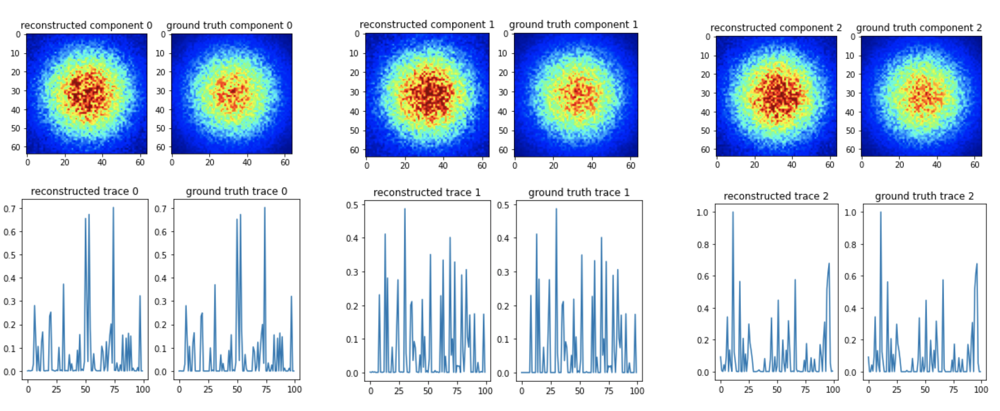
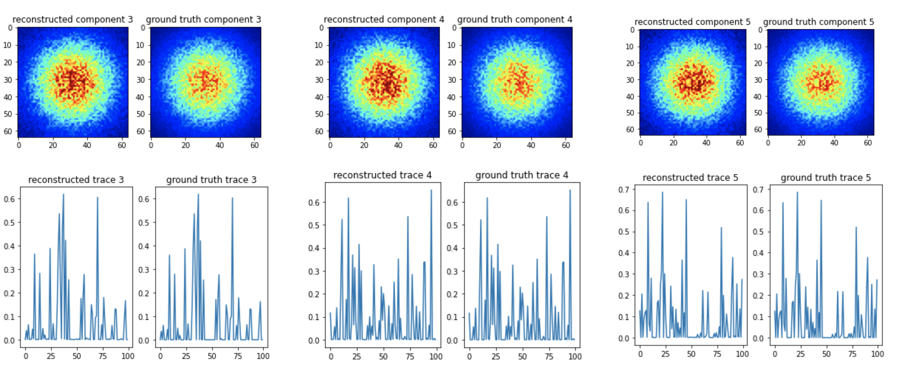
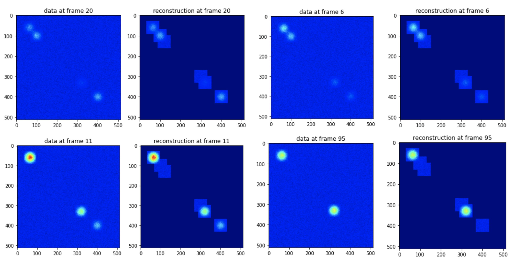
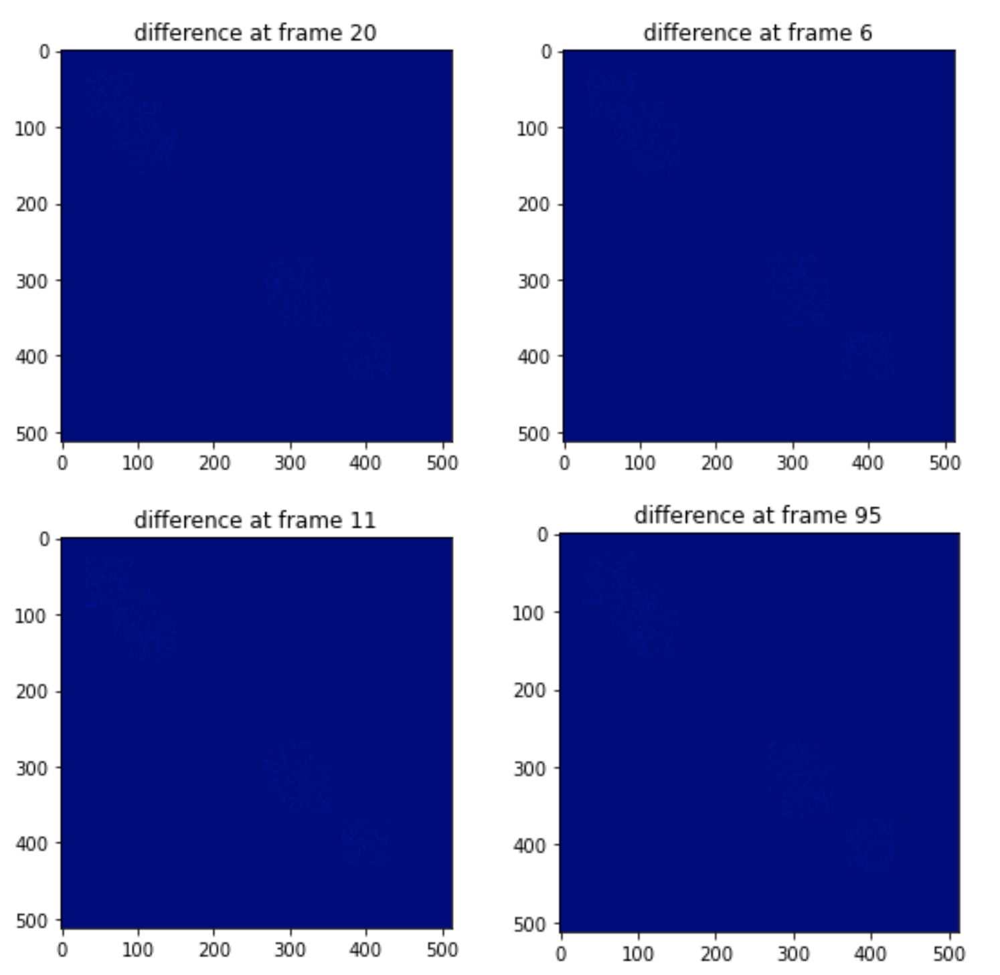

# Distributed Non-negative Matrix Factorization (DNMFX) with JAX

## Content

  - [About DNMFX](#about-dnmfx)
  - [Setup](#setup)
  - [Usage](#usage)
    - [Prepare input data](#prepare-input-data)
      - [get `sequence`](#get-sequence)
      - [define `bounding_boxes`](#define-bounding_boxes)
      - [create a zarr container](#create-a-zarr-container)
    - [Evaluate the fitting results](#evaluate-the-fitting-results)
  - [Example on synthetic data](#example-on-synthetic-data)
## About DNMFX
DNMFX is a distributed algorithm based on stochastic gradient descent non-negative matrix factorization to be applied on reconstructing fluorescent cell components (`H`), their activity traces (`W`), and the background of where the cells locate (`B`). DNMFX optimizes `H`, `W`, `B`, at each time frame, such that
 
$$X[t] ≈ ∑_kW[t, k]H[k] + B[k] = \hat{X}[t]$$

where $$X$$ is input imaging data and $$\hat{X}$$ is its reconstruction; $$k$$ is the (cell) component index; $$t$$ is the time frame index.


## Setup
To install DNMFX and its dependencies, run:
```py
$ git clone https://github.com/kunyanglu/DNMFX.git
$ cd DNMFX/
$ pip install .
```

```py
$ pip install -r requirements.txt
```

## Usage
### Prepare input data

DNMFX assumes the input data to be a zarr container, which should at least contain two important pieces of information: `sequence`  and `bounding_boxes`.

* `sequence` is simply a sequence of images each from a time frame. It should be an array-like data structure with shape `(t, w, h)`, where `t` is the number of frames; `w` is the image width; `h` is the image height.
* `bounding_boxes` are rectangular boxes around the (cell) component as the figure shows below. Each bounding box defines an approximate region where a component occupies.


To use DNMFX, we need to 
* **get `sequence`** in the right shape and type; 
* **define `bounding_boxes`**; 
* call one of our functions `write_dataset` to **create a zarr container** from the input data.

The following code snippet demonstrates how to accomplish all three steps mentioned above:

#### get `sequence`
```py
sequence = get_sequence(raw_data)
```
#### define `bounding_boxes`
```py
import funlib.geometry as fg

# Suppose we have one bounding box centered at x=20, y=10,
# the other centered at x=40, y=13; both boxes have shape (64,64)

bounding_boxes = [fg.Roi((10, 20), (64, 64)),
  fg.Roi((13, 40), (64, 64))]
```

#### create a zarr container
```py

from dnmfx.Dataset import Dataset
from dnmfx.io import write_dataset

mydata = Dataset()
mydata.sequence = sequence
mydata.bounding_boxes = bounding_boxes

dataset_path = "datasets/mydataset_path"

write_dataset(mydata, dataset_path)
```

### Fit on the input data

To reconstruct the input data by optimizing `H`, `W`, `B`, all we need is one function call to `fit`.

```py
from dnmfx.fit import fit

H, W, B, log = fit(dataset_path,
                   max_iteration,
                   min_loss,
                   batch_size,
                   step_size,
                   l1_weight,
                   log_every,
                   log_gradients,
                   random_seed)
```

**`dataset_path`** *(string, required)*: path to the zarr container containing the dataset. The dataset should have a `sequence` dataset of shape `(t, z, y, x)`. To construct `sequence`, see [Prepare input data](#prepare-input-data).

**`max_iteration`** *(int, default=10000)*: the maximum number of iterations. If hit, fitting terminates and the current optimization results are returned.

**`min_loss`** *(float, default=1e-3)*: the minimum reconstruction loss. If reaches, fitting terminates and the current optimization results are returned.

**`batch_size`** *(int, default=10)*: number of time frames within a batch.

**`step_size`** *(float, default=1e-1)*: size of update that DNMFX takes at each iteration.

**`l1_weight`** *(float, default=0)*: parameter for regularizing; how much penalty to give for component and trace loss.

**`log_gradients`** *(boolean, default=False)*: whether or not to log the gradients at the first iteration (may be useful for testing).

**`random_seed`** *(int, default=None)*: random seed for producing reproducible results. If set to `None`, the algorithm uses the current time as seed.

### Evaluate the fitting results

To evaluate the optimization results, we can call `evaluate` to get the reconstruction error per pixel and the difference sequence between reconstruction and input data if we choose.

```py
from dnmfx.evaluate import evaluate

reconstruction_error, diff_image = evaluate(H, W, B,
                                            sequence, 
                                            show_diff=True)
```
## Example on synthetic data

Here is the synthetic data we will use in this example:

https://user-images.githubusercontent.com/29853327/186127645-44a05c8f-b298-435a-ad47-68ac7f9f1cbb.mov

Apply DNMFX on the input data:

```py
from dnmfx.io import read_dataset
from dnmfx.fit import fit
from dmfx.evaluate import evaluate

dataset_path = 'datasets/toy_data_20220726.zarr'

dataset = read_dataset(dataset_path)
sequence = dataset.sequence

H, W, B, log = fit(dataset_path,
                   max_iteration=1000000,
                   random_seed=2022)

reconstruction_error, diff_sequence = evaluate(H, W, B,
                                               sequence,
                                               show_diff=True)
```
For we know the ground truth component and traces, we can compare our reconstruction with the ground truth.




Let's compare the reconstructed sequence (i.e. $$\hat{X}$$) with the ground truth sequence (i.e. $$X$$) for a few selected frames.



The reconstruction looks great! It is also evident in the difference sequence--there is barely any difference!


